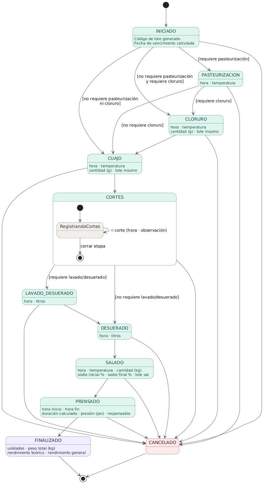

# Estados de lote

Documenta el ciclo de vida del lote y la implementacion del patron State GoF en el modulo de produccion.

## Diagrama de estados (PlantUML)


```
@startuml

skinparam state {
  BackgroundColor #F1EFE8
  BorderColor #5F5E5A
  FontColor #2C2C2A
  ArrowColor #5F5E5A
  StartColor #2C2C2A
  EndColor #2C2C2A
}

skinparam state<<activo>> {
  BackgroundColor #E1F5EE
  BorderColor #0F6E56
  FontColor #085041
}

skinparam state<<terminal_ok>> {
  BackgroundColor #EEEDFE
  BorderColor #534AB7
  FontColor #26215C
}

skinparam state<<terminal_err>> {
  BackgroundColor #FCEBEB
  BorderColor #A32D2D
  FontColor #501313
}

[*] --> INICIADO

state INICIADO <<activo>>
INICIADO : Codigo de lote generado
INICIADO : Fecha de vencimiento calculada

state PASTEURIZACION <<activo>>
PASTEURIZACION : hora · temperatura

state CLORURO <<activo>>
CLORURO : hora · temperatura
CLORURO : cantidad (g) · lote insumo

state CUAJO <<activo>>
CUAJO : hora · temperatura
CUAJO : cantidad (g) · lote insumo

state LAVADO_DESUERADO <<activo>>
LAVADO_DESUERADO : hora · litros

state DESUERADO <<activo>>
DESUERADO : hora · litros

state SALADO <<activo>>
SALADO : hora · temperatura · cantidad (kg)
SALADO : sodio inicial % · sodio final % · lote sal

state PRENSADO <<activo>>
PRENSADO : hora inicio · hora fin
PRENSADO : duracion calculada · presion (psi) · responsable

state FINALIZADO <<terminal_ok>>
FINALIZADO : unidades · peso total (kg)
FINALIZADO : rendimiento teorico · rendimiento general

state CANCELADO <<terminal_err>>

state CORTES <<activo>> {
  [*] --> RegistrandoCortes
  RegistrandoCortes --> RegistrandoCortes : + corte (hora · observacion)
  RegistrandoCortes --> [*] : cerrar etapa
}

state CORTES_CERRADOS <<activo>>

INICIADO --> PASTEURIZACION  : [requiere pasteurizacion]
INICIADO --> CLORURO         : [no requiere pasteurizacion\ny requiere cloruro]
INICIADO --> CUAJO           : [no requiere pasteurizacion\nni cloruro]

PASTEURIZACION --> CLORURO   : [requiere cloruro]
PASTEURIZACION --> CUAJO     : [no requiere cloruro]

CLORURO --> CUAJO

CUAJO --> CORTES

CORTES --> CORTES_CERRADOS

CORTES_CERRADOS --> LAVADO_DESUERADO  : [requiere lavado/desuerado]
CORTES_CERRADOS --> DESUERADO         : [no requiere lavado/desuerado]

LAVADO_DESUERADO --> DESUERADO

DESUERADO --> SALADO

SALADO --> PRENSADO

PRENSADO --> FINALIZADO

FINALIZADO --> [*]

INICIADO         --> CANCELADO
PASTEURIZACION   --> CANCELADO
CLORURO          --> CANCELADO
CUAJO            --> CANCELADO
CORTES           --> CANCELADO
LAVADO_DESUERADO --> CANCELADO
DESUERADO        --> CANCELADO
SALADO           --> CANCELADO
PRENSADO         --> CANCELADO

CANCELADO --> [*]

@enduml
```

## Implementacion del patron State GoF

### Objetivo

Concentrar la logica de transiciones de `EstadoLote` en clases por estado para evitar condicionales dispersos y mantener la coherencia con el diagrama.

### Estructura en el proyecto

Ubicacion: `src/main/java/com/rochela/rochelasystem/modulos/produccion/state`

- `LoteState`: interfaz comun para las transiciones.
- `StateResolver`: mapa de estados a implementaciones.
- `LoteStateContext`: contexto con banderas del producto que afectan las transiciones.
- `Estado*`: una clase por cada estado del diagrama.

### Reglas de transicion clave

- `INICIADO` decide entre `PASTEURIZACION`, `CLORURO` o `CUAJO` segun las banderas del producto.
- `PASTEURIZACION` decide entre `CLORURO` o `CUAJO`.
- `CORTES` decide `CORTES_CERRADOS`.
- `CORTES_CERRADOS` decide entre `LAVADO_DESUERADO` o `DESUERADO`.
- `FINALIZADO` y `CANCELADO` son terminales y no aceptan transiciones.

### Como encaja en el proyecto

- `Lote.estadoActual` guarda el estado persistente.
- Los servicios de produccion resuelven el estado actual con `StateResolver`.
- Al registrar una etapa, se llama `avanzar(context)` y se persiste el nuevo estado.

### Ejemplo conceptual (no es codigo de servicio)

```
StateResolver resolver = new StateResolver();
LoteStateContext context = new LoteStateContext(
    producto.getRequierePasteurizacion(),
    producto.getRequiereCloruro(),
    producto.getRequiereLavadoDesuerado(),
    resolver
);

LoteState estadoActual = resolver.resolve(lote.getEstadoActual());
LoteState siguiente = estadoActual.avanzar(context);

lote.setEstadoActual(siguiente.getEstado());
```
